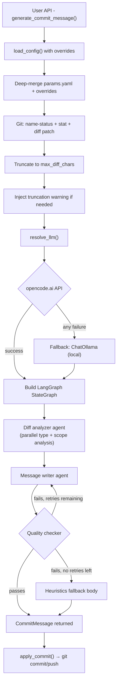

# LangChain AutoCommit v2

**LangChain AutoCommit** is an **agentic Git automation** library with automatic API fallback.  
It reads configuration from a bundled `params.yaml` file, uses the **opencode.ai API** as the primary LLM (serving models like DeepSeek, Qwen, Kimi), and falls back to a **local Ollama model** if the API is unavailable. It generates **conventional commit messages** based on the current Git diff.

New in v2: installable **Python library** with a clean programmatic API, deep-merge config overrides, and an optional CLI.

---

## Package Structure

| Path | Description |
|------|--------------|
| `autocommit/__init__.py` | Public API: `generate_commit_message`, `apply_commit`, `generate_and_commit`, `CommitMessage`, `load_config`, `deep_merge` |
| `autocommit/core.py` | Core library — commit message generation and application |
| `autocommit/config.py` | Config loader with deep-merge override support |
| `autocommit/cli.py` | Optional CLI entrypoint |
| `autocommit/chains/commit_chain.py` | LangGraph StateGraph with three specialized agents (diff analyzer, message writer, quality checker) and automatic quality-loop retries |
| `autocommit/utils/git_utils.py` | Lightweight Git wrapper using subprocess |
| `autocommit/utils/llm_provider.py` | LLM provider resolution with automatic fallback |
| `autocommit/utils/keychain.py` | macOS Keychain wrapper; env var also supported |
| `autocommit/utils/pr_token.py` | Pull-request API token resolution from an environment variable or macOS Keychain |
| `autocommit/utils/pr_utils.py` | GitHub/GitLab pull-request creation and provider detection |
| `autocommit/params.yaml` | Bundled default configuration |
| `pyproject.toml` | Package metadata and dependencies |
| `run_venv.sh` | Development setup script — creates a `.venv`, installs deps, and builds the package |
| `tests/` | pytest suite |

---

## Development Setup

For contributors or local development, use `run_venv.sh` to bootstrap the environment:

```bash
./run_venv.sh
```

This creates a `.venv` in the repo root, installs all dependencies (including dev/test extras), installs the package in editable mode, and builds the package. The CLI entry point will be available at `.venv/bin/autocommit`.

---

## Spec-Driven Development

This repository uses a local SpecRepo scaffold in `specrepo/`.

Feature work should start by adding a request file under
`specrepo/requests/` using `specrepo/templates/feature-request.md`. A spec
reviewer then creates an architecture proposal under `specrepo/proposals/` and
asks for approval. Implementation begins only after a human approval record
exists under `specrepo/approved/` and a coding agent has recorded its
pre-implementation architecture review under `specrepo/implementation-reviews/`.

The current product, architecture, and quality baseline lives in
`specrepo/specs/`.

---

## Library Usage

### Install

```bash
pip install git+https://github.com/brandon-benge/langchain_autocommit.git
```

Or pin to a tag or branch:

```bash
pip install git+https://github.com/brandon-benge/langchain_autocommit.git@v2.0.0
pip install git+https://github.com/brandon-benge/langchain_autocommit.git@main
```

### Quick Start

```python
from autocommit import generate_commit_message, apply_commit

# Generate a commit message from staged changes
msg = generate_commit_message()
print(msg.subject)
print(msg.body)

# Apply it
apply_commit(msg)
```

### One-liner

```python
from autocommit import generate_and_commit

msg = generate_and_commit()
```

### With Overrides

All overrides are keyword arguments. The bundled `params.yaml` provides defaults for any value you don't supply.

```python
from autocommit import generate_and_commit

msg = generate_and_commit(
    type="feat",
    scope="api",
    ticket="PROJ-123",
    context="Added rate limiting middleware",
    committer="Jane Doe",
    config_overrides={"git": {"max_subject_length": 120}},
)
```

### Config Overrides

Configuration files are selected in this order:

1. An explicit Python `config_path` or CLI `--config-file`.
2. A non-empty `AUTOCOMMIT_PARAMS` environment variable.
3. The bundled `autocommit/params.yaml` default.

Set a persistent custom config path without repeating `--config-file`:

```bash
export AUTOCOMMIT_PARAMS="$HOME/.config/autocommit/params.yaml"
autocommit --dry-run
```

An explicit `config_path` or `--config-file` always overrides
`AUTOCOMMIT_PARAMS`. A selected custom YAML file replaces the bundled base; it
is not merged with the bundled file. Dictionary and CLI overrides are then
deep-merged on top of the selected file.

You can override any part of the selected config with a dict that gets
deep-merged, or point to a completely different YAML file:

```python
from autocommit import load_config, generate_commit_message

# Use a custom config file instead of the bundled params.yaml
cfg = load_config(config_path="./project-config.yaml", overrides={
    "llm": {
        "primary": {"model": "deepseek-v4-pro"},
    },
    "git": {
        "autostage_all": False,
        "push_after_commit": False,
    },
})

msg = generate_commit_message(config=cfg)
```

Or pass `config_overrides` directly to the convenience functions:

```python
msg = generate_commit_message(
    config_overrides={"llm": {"primary": {"timeout": 120}}}
)
```

### Full `generate_commit_message()` Signature

```python
def generate_commit_message(
    *,
    config: dict | None = None,
    config_path: str | None = None,
    config_overrides: dict | None = None,
    type: str | None = None,
    scope: str | None = None,
    ticket: str | None = None,
    context: str = "",
    committer: str = "",
    max_subject_length: int | None = None,
    cwd: str | None = None,
    autostage: bool | None = None,
    conventional: bool | None = None,
    dry_run: bool = False,
) -> CommitMessage
```

- `CommitMessage` is a `NamedTuple` with `.subject` and `.body` fields.
- When `None`, each parameter falls back to the merged config (params.yaml + overrides).
- Returns an empty `CommitMessage` (both fields `""`) when there are no changes.

### Full `apply_commit()` Signature

```python
def apply_commit(
    message: CommitMessage,
    *,
    cwd: str | None = None,
    signoff: bool = False,
    amend: bool = False,
    push_after: bool = False,
    push_set_upstream: bool = True,
    auto_pr_enabled: bool | None = None,
    auto_pr_target_branch: str | None = None,
    auto_pr_title: str | None = None,
    auto_pr_body: str | None = None,
) -> str | None
```

When automatic PR creation is enabled, `apply_commit()` creates the PR only
after a requested push completes successfully. It returns the created PR URL,
or `None` when no PR is created. Direct callers use the bundled auto-PR token
configuration unless the call comes through a config-aware workflow such as
the CLI or `generate_and_commit()`.

### Full `generate_and_commit()` Signature

```python
def generate_and_commit(
    *,
    config: dict | None = None,
    config_path: str | None = None,
    config_overrides: dict | None = None,
    type: str | None = None,
    scope: str | None = None,
    ticket: str | None = None,
    context: str = "",
    committer: str = "",
    max_subject_length: int | None = None,
    cwd: str | None = None,
    autostage: bool | None = None,
    conventional: bool | None = None,
    signoff: bool | None = None,
    amend: bool | None = None,
    push_after: bool | None = None,
) -> CommitMessage
```

---

## Configuration

All runtime defaults are defined in the bundled
[`autocommit/params.yaml`](autocommit/params.yaml). This single file is the
source of truth for every configurable parameter — LLM provider settings,
Git behavior, quality-loop controls, auto-PR options, and more. Commented
descriptions explain each field inline.

Overrides are applied via the deep-merge mechanism described in
[Config Overrides](#config-overrides). Explicit API parameters,
CLI flags, and `config_overrides` dicts take precedence over the YAML
defaults.

---

## How Type, Scope, and Ticket Are Resolved

You don't need to pass any overrides — these values are inferred automatically from your repository state:

| Value | Source | Default | Example |
|-------|--------|---------|---------|
| **type** | File path heuristics: `tests/` `__tests__/` `*_test.py` `*.test.js` `*.spec.ts` → `test`; `fix/` `patches/` `hotfix/` → `fix`; `docs/` `*.md` → `docs`; `scripts/` `.github/` `ci/` `config/` `docker/` `*.sh` `*.yml` `Dockerfile` → `chore`; `src/` `api/` `app/` `ui/` `db/` etc. → `feat` | `git.default_type` (`"chore"`) | `feat`, `docs`, `test`, `fix`, `chore` |
| **scope** | Basename of the current working directory (the repo folder name) | `git.scope_from_folder: true` | `langchain_autocommit` |
| **ticket** | Regex match against the current git branch name | `git.ticket_regex` (`[A-Z]{2,}-\d+`) | `PROJ-123` from branch `feat/PROJ-123-add-auth` |

To customize any of these, pass overrides in your code or edit the `params.yaml` bundled with the package.

---

## How Commit Messages Are Generated

The utility prioritizes **factual accuracy** by sending the LLM a rich view of the actual changes:

1. **Git data collection** — The staged diff is collected in three forms: `--name-status` (what files changed and how), `--stat` (line counts per file), and the **full diff patch** (actual code changes with `+`/`-` lines).
2. **Metadata inference** — Commit type, scope, and ticket ID are inferred from file paths, folder name, and branch name.
3. **Controlled truncation** — If the diff patch is too large, it's truncated to `max_diff_chars` characters (default 8000). A warning is injected into the prompt so the LLM knows its view is incomplete.
4. **LangGraph state graph** — A compiled `StateGraph` runs three specialized agents in sequence:
   - **Diff analyzer** — Runs `analyze_type` and `analyze_scope` LLM sub-tasks concurrently on the full diff.
   - **Message writer** — Consumes the structured analysis plus the raw diff to produce a draft `CommitMessage`.
   - **Quality checker** — Runs deterministic rules on the draft. If checks fail and the retry budget (`git.quality.max_retries`, default 2) is not exhausted, routes back to the message writer with a critique.
5. **Graceful fallback** — If all LLM agents fail or return unparseable output, a heuristics-based body is generated listing the changed files. When a primary LLM call fails and the fallback model is used, a warning naming the failed step may appear in CLI output.

### Data Flow



---

## API Key Setup

### Option A: Environment variable (recommended for cloud/CI)

```bash
export OPENCODE_API_KEY="your-api-key"
```

The bundled `params.yaml` uses `env_var: "OPENCODE_API_KEY"` by default — no changes needed.

### Option B: macOS Keychain (CLI only)

```bash
autocommit --setup-key
```

Then enable keychain at runtime with:

```bash
autocommit --keychain
```

Or switch back to environment variable with:

```bash
autocommit --env-var
```

You can also specify custom keychain credentials:

```bash
autocommit --keychain --keychain-service "myapp" --keychain-key "prod_key"
```

> **Important:** Only ONE method may be active at a time. Enabling `--keychain` automatically disables the env var method (and vice versa). Passing both explicitly raises an error.

### Pull-request token and optional dependencies

Automatic PR creation is disabled by default. Install the provider integration
you need:

```bash
# GitHub; the auto-pr extra is currently a GitHub convenience alias
pip install 'langchain-autocommit[auto-pr]'

# GitLab
pip install 'langchain-autocommit[gitlab]'
```

For GitHub, set the environment variable named by
`git.auto_pr.token_env_var` (default `GITHUB_TOKEN`):

```bash
export GITHUB_TOKEN="your-github-token"
```

For GitLab, point `token_env_var` at a GitLab token variable and install the
separate `gitlab` extra:

```yaml
git:
  auto_pr:
    enabled: true
    target_branch: main
    token_env_var: GITLAB_TOKEN
```

As an alternative to an environment variable, configure
`git.auto_pr.keychain.service` and `git.auto_pr.keychain.key` in YAML. The PR
token is never printed. PR creation requires push to be enabled and is skipped
with an informational log when the current branch already matches the target.

---

## CLI Usage (Optional)

The CLI is available as a secondary entry point:

```bash
autocommit --autostage
```

Pass `-y` to skip the confirmation prompt:

```bash
autocommit -y --context "Refactored auth middleware"
```

Override config at runtime:

```bash
autocommit --model deepseek-v4-pro --config-file ./project-config.yaml --push-set-upstream
```

### CLI Flags

| Flag | Description |
|------|-------------|
| | **Commit message** |
| `-c, --context TEXT` | Optional context describing what changed and why |
| `-n, --committer TEXT` | Committer name to include in commit body |
| `-t, --type TYPE` | Override commit type |
| `-s, --scope SCOPE` | Override commit scope |
| `--ticket TICKET` | Override ticket ID |
| `--max-subject-length N` | Override max subject length |
| | **Git behavior** |
| `--autostage` / `--no-autostage` | Enable/disable auto-staging |
| `--amend` / `--no-amend` | Enable/disable amending |
| `--push` / `--no-push` | Enable/disable push after commit |
| `--push-set-upstream` / `--no-push-set-upstream` | Enable/disable automatic upstream tracking branch setup |
| `--auto-pr` / `--no-auto-pr` | Enable/disable PR creation after a successful push |
| `--auto-pr-target-branch BRANCH` | Override the PR target branch |
| `--auto-pr-title TEXT` | Override the PR title (default: commit subject) |
| `--auto-pr-body TEXT` | Override the PR body (default: commit body) |
| `--signoff` / `--no-signoff` | Enable/disable Signed-off-by |
| `--conventional` / `--no-conventional` | Enable/disable conventional format |
| | **Quality loop** |
| `--quality-max-retries N` | Override max quality-loop retries (`git.quality.max_retries`) |
| `--min-body-lines N` | Override min body lines for quality check (`git.quality.min_body_lines`) |
| `--check-boilerplate` / `--no-check-boilerplate` | Enable/disable boilerplate detection in quality check |
| | **Runtime** |
| `--dry-run` | Show proposed commit without applying |
| `-y, --yes` | Skip confirmation prompt |
| `--show-config` | Print parsed config and exit |
| `--setup-key` | Store API key in macOS Keychain |
| `--config-file PATH` | Path to a custom YAML config file (overrides `AUTOCOMMIT_PARAMS` and bundled `params.yaml`) |
| | **LLM overrides** |
| `--keychain` / `--no-keychain` | Enable/disable API key lookup from macOS Keychain |
| `--keychain-service TEXT` | Keychain service name (default: `langchain_autocommit`) |
| `--keychain-key TEXT` | Keychain key name (default: `opencode_api_key`) |
| `--keychain` and `--env-var` are mutually exclusive; enabling one auto-disables the other |
| `--env-var` / `--no-env-var` | Enable/disable API key lookup from env var |
| `--env-var-name TEXT` | Environment variable name (default: `OPENCODE_API_KEY`) |
| `--base-url TEXT` | Override LLM base URL |
| `--model TEXT` | Override LLM model name |
| `--temperature FLOAT` | Override LLM temperature |
| `--max-tokens N` | Override LLM max tokens |
| `--timeout N` | Override LLM timeout in seconds |

---

## Testing

```bash
python -m pytest
```

With coverage:

```bash
python -m pytest --cov-report=term-missing
```

---

## LangGraph Design Pattern

The graph in `autocommit/chains/commit_chain.py` is a **LangGraph `StateGraph`** that orchestrates multiple specialized agents and a quality loop:

```python
graph = StateGraph(GraphState)

graph.add_node("analyze_diff", analyze_diff)
graph.add_node("write_message", write_message)
graph.add_node("check_quality", check_quality)

graph.set_entry_point("analyze_diff")
graph.add_edge("analyze_diff", "write_message")
graph.add_conditional_edges(
    "check_quality",
    should_retry,  # routes back to write_message or to END
)
graph.add_edge("write_message", "check_quality")
```

Key features:
- **Parallel sub-tasks** — `analyze_diff` runs type inference and scope inference concurrently via `invoke()` on each sub-agent.
- **Quality loop** — `check_quality` evaluates the draft deterministically. On failure with retries remaining, the graph routes back to `write_message` with a critique in the state.
- **Provider agnostic** — The graph accepts any LangChain chat model; primary and fallback LLMs are resolved before graph construction.

---

## Design Principles

| Principle | Implementation |
|------------|----------------|
| **YAML-Driven Config** | All parameters read from bundled `params.yaml` |
| **Deep-Merge Overrides** | Programmatic config overrides merge recursively |
| **Secure Key Storage** | API key from env var or macOS Keychain |
| **Automatic Fallback** | Primary API failure → local Ollama |
| **Provider Agnostic** | Graph accepts any LangChain chat model |
| **Configurable Quality Loop** | LangGraph `StateGraph` with retry budget, min body lines, and boilerplate detection |
| **Library-First** | Clean Python API as the primary interface |

---

## License

- Project: **Apache-2.0**
- Dependencies:
  - **LangChain** – MIT
  - **keyring** – MIT
  - **Ollama** – Apache 2.0
  - **Python stdlib** – PSF License
