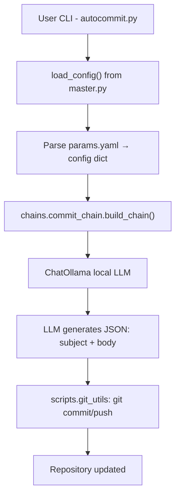

# 🧠 LangChain AutoCommit v2

**LangChain AutoCommit** is a **local-only, agentic Git automation tool**.  
It reads configuration from a `params.yaml` file, uses a local **Ollama LLM** (like `qwen3:8b`), and generates **conventional commit messages** based on the current Git diff.

This version (v2) makes **`autocommit.py`** the **only CLI entrypoint**.  
All configuration logic is downstream in `master.py`, following your project rule that `master.py` should never be directly executed.

---

## 🗂️ Project Structure

| Path | Description |
|------|--------------|
| `autocommit.py` | Main CLI entrypoint — runs LangChain commit chain and handles Git logic. |
| `master.py` | Utility module that loads and parses `params.yaml` (downstream only). |
| `params.yaml` | Central config file (no hardcoded variables anywhere). |
| `chains/commit_chain.py` | Defines the LangChain pipeline using `PromptTemplate` + `ChatOllama`. |
| `scripts/git_utils.py` | Lightweight Git wrapper using subprocess (no external SDKs). |
| `requirements.txt` | Local-only dependencies (Apache/MIT-licensed). |
| `run_venv.sh` | Script to bootstrap a Python virtual environment. |
| `README.md` | You are here. |

---

## 🚀 How It Works



### 🔁 Control Flow Summary

1. **User runs**  
   ```bash
   python autocommit.py --autostage
   ```

2. **autocommit.py**
   - Imports `load_config()` from `master.py`.
   - Reads `params.yaml` into a Python dictionary.
   - Determines what files changed, which branch is active, etc.
   - Builds a LangChain pipeline (`PromptTemplate` → `ChatOllama`).

3. **The LLM (qwen3:8b, Mistral, etc.)**
   - Takes Git diff summary + context.
   - Generates a structured JSON object:
     ```json
     {
       "subject": "feat(core): add logging middleware",
       "body": "Adds request logging for all API calls to help debugging."
     }
     ```

4. **autocommit.py applies the result**
   - Prompts for confirmation (unless `-y` is passed).
   - Runs `git commit -m <subject> -m <body>`.
   - Optionally pushes to remote if configured in `params.yaml`.

---

## 🧩 Configuration: `params.yaml`

All runtime values are read from here.  
No constants are hardcoded in the codebase.

### Example

```yaml
llm:
  provider: "ollama"
  base_url: "http://localhost:11434"
  model: "qwen3:8b"
  temperature: 0.2
  max_tokens: 512

git:
  autostage_all: false
  signoff: false
  push_after_commit: false
  allow_amend: false
  conventional: true
  default_type: "chore"
  scope_from_folder: true
  max_subject_length: 72
  ticket_regex: "[A-Z]{2,}-\\d+"
```

### Notable Fields

| Section | Key | Meaning |
|----------|-----|---------|
| **llm** | `provider` | Local model backend (`ollama`) |
|  | `model` | Model name, e.g. `qwen3:8b`, `mistral`, `llama3` |
|  | `temperature` | Sampling temperature (lower = more deterministic) |
|  | `max_tokens` | Max tokens for generation |
| **git** | `autostage_all` | If true, automatically stages all changes |
|  | `conventional` | Enforces `<type>(<scope>): <subject>` style |
|  | `ticket_regex` | Extracts ticket ID from branch name |
|  | `max_subject_length` | Clamps subject length to a safe limit |

---

## ⚙️ Installation & Setup

### 1️⃣ Create a virtual environment

```bash
chmod +x run_venv.sh
./run_venv.sh
source ../venv/bin/activate
```

### 2️⃣ Ensure Ollama is running

```bash
ollama serve &
ollama pull qwen3:8b
```

### 3️⃣ Run from any Git repo

```bash
python /path/to/autocommit.py --autostage
```

or symlink for global usage:

```bash
chmod +x autocommit.py
sudo ln -s "$(pwd)/autocommit.py" /usr/local/bin/autocommit
autocommit --autostage
```

### 4️⃣ Available CLI Flags

| Flag | Description |
|------|-------------|
| `--dry-run` | Show proposed commit without applying it |
| `--autostage` | Automatically stage all modified files |
| `--amend` | Amend previous commit |
| `-y, --yes` | Skip confirmation prompt |
| `--show-config` | (debug) Show parsed YAML config |

---

## 🧠 Example Interaction

```bash
$ autocommit --autostage

--- Proposed Commit ---
feat(auth): add token refresh support

Implements auto-refresh when a 401 occurs to improve user experience.
Tokens now refresh transparently and retry the failed call.

-----------------------

Proceed with commit? [y/N]: y
Committed.
```

---

## 🧰 Internals

### `master.py`
A small utility that only:
1. Reads `params.yaml`.
2. Converts it into nested Python dicts.
3. Exports `load_config()` to downstream scripts.

### `autocommit.py`
- Imports `load_config()` and other helpers.
- Orchestrates Git diff collection and LLM invocation.
- Commits changes using results from the chain.

### `chains/commit_chain.py`
- Defines a `PromptTemplate` describing conventional commit rules.
- Uses `ChatOllama` as the model backend.
- Returns LLM output as a JSON object.

### `scripts/git_utils.py`
- Runs shell-based Git commands.
- Provides helper functions:
  - `changed_files()`
  - `current_branch()`
  - `commit()`
  - `push()`
  - `infer_type_from_paths()`

---

## 🧩 LangChain Design Pattern

The chain in `chains/commit_chain.py` is deliberately simple:

```python
chain = (
    RunnableMap({
        "type": lambda x: x.get("type"),
        "scope": lambda x: x.get("scope"),
        "diff_summary": lambda x: x.get("diff_summary")[:4000],
    })
    | PromptTemplate.from_template(COMMIT_PROMPT)
    | ChatOllama(model="qwen3:8b", base_url="http://localhost:11434")
)
```

This keeps the project fully **LangChain-native**, using:
- `RunnableMap` for variable injection,
- `PromptTemplate` for input templating,
- `ChatOllama` for local LLM inference.

---

## 🧱 Design Principles

| Principle | Implementation |
|------------|----------------|
| **YAML-Driven Config** | All parameters read from `params.yaml` |
| **Local-Only Execution** | Uses `ollama` HTTP API; no external SaaS |
| **Apache / MIT-Only Licenses** | LangChain is MIT; all other libs are stdlib |
| **No Hardcoded Values** | Paths, model names, thresholds, etc. come from YAML |
| **CLI Simplicity** | Single entrypoint (`autocommit`) for easy `$PATH` usage |
| **Downstream Master** | `master.py` provides utilities, never invoked directly |

---

## 🧩 Extending the System

This architecture is modular and supports additional chains easily.

| Feature | New File | Description |
|----------|-----------|-------------|
| **Generate changelog** | `chains/changelog_chain.py` | Summarize multiple commits. |
| **Summarize code diffs** | `chains/diff_summary_chain.py` | LLM-based diff-to-summary chain. |
| **Classify commit types** | `chains/commit_classifier.py` | Detect if a change is `feat`, `fix`, etc. |
| **Multi-tool agent** | `agent.py` | Combine `autocommit`, `changelog`, etc. with routing logic. |

---

## 🪪 License

- Project: **Apache-2.0**
- Dependencies:
  - **LangChain** – MIT
  - **Ollama** – Apache 2.0 (for Granite, Mistral models)
  - **Python stdlib** – PSF License

---

🧰 **In short:**  
You can now type `autocommit` from *any Git repo*, and it will:
1. Read your YAML config,
2. Analyze your diff,
3. Generate a conventional commit via LLM,
4. Apply it — all without touching the cloud.
