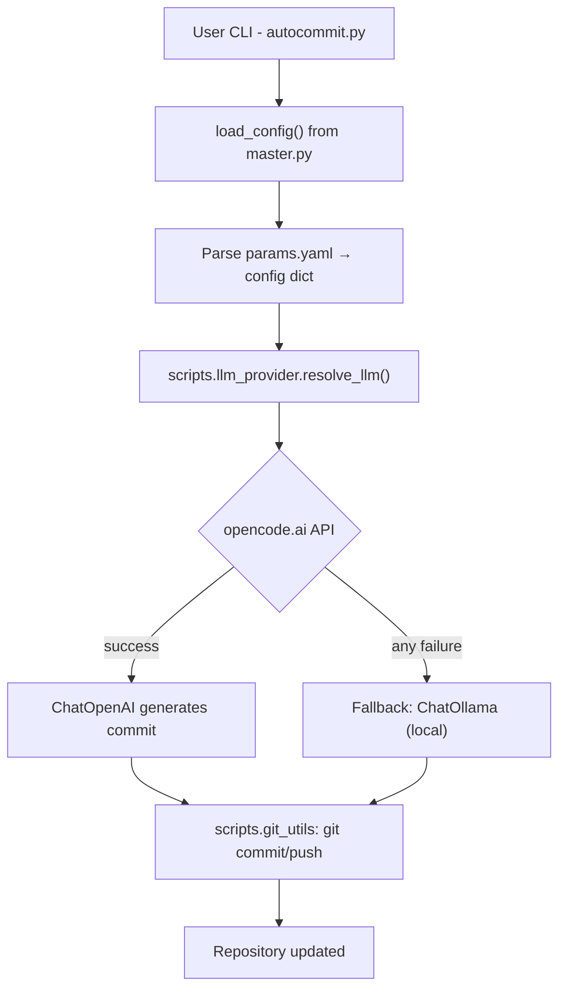

# LangChain AutoCommit v2

**LangChain AutoCommit** is an **agentic Git automation tool** with automatic API fallback.  
It reads configuration from a `params.yaml` file, uses the **opencode.ai API** as the primary LLM (serving models like DeepSeek, Qwen, Kimi), and falls back to a **local Ollama model** if the API is unavailable. It generates **conventional commit messages** based on the current Git diff.

This version (v2) makes **`autocommit.py`** the **only CLI entrypoint**.  
All configuration logic is downstream in `master.py`.

---

## Project Structure

| Path | Description |
|------|--------------|
| `autocommit.py` | Main CLI entrypoint — runs LangChain commit chain and handles Git logic. |
| `master.py` | Utility module that loads and parses `params.yaml`. |
| `params.yaml` | Central config file (no hardcoded variables anywhere). |
| `chains/commit_chain.py` | Defines the LangChain pipeline using `PromptTemplate` + any chat model. |
| `scripts/git_utils.py` | Lightweight Git wrapper using subprocess (no external SDKs). |
| `scripts/llm_provider.py` | Resolves the LLM provider with automatic fallback (opencode.ai → Ollama). |
| `scripts/keychain.py` | macOS Keychain wrapper for secure API key storage. |
| `requirements.txt` | Dependencies (Apache/MIT-licensed). |
| `run_venv.sh` | Script to bootstrap a Python virtual environment. |
| `README.md` | You are here. |

---

## How It Works



### Control Flow Summary

1. **User runs**  
   ```bash
   python autocommit.py --autostage
   ```

2. **autocommit.py**
   - Imports `load_config()` from `master.py`.
   - Reads `params.yaml` into a Python dictionary.
   - Determines what files changed, which branch is active, etc.
   - Calls `resolve_llm()` to select a provider (opencode.ai → Ollama fallback).
   - Builds a LangChain pipeline with the resolved LLM.

3. **The LLM (deepseek-v4-flash via opencode.ai, falling back to qwen3:8b locally)**
   - Takes Git diff summary + context.
   - Generates a structured JSON object:
     ```json
     {
       "subject": "feat(core): add logging middleware",
       "body": "Adds request logging for all API calls to help debugging."
     }
     ```

4. **autocommit.py applies the result**
   - Prompts for confirmation (unless `-y` is passed).
   - Runs `git commit -m <subject> -m <body>`.
   - Optionally pushes to remote if configured in `params.yaml`.

---

## Configuration: `params.yaml`

All runtime values are read from here.  
No constants are hardcoded in the codebase.

### Example

```yaml
llm:
  primary:
    base_url: "https://opencode.ai/zen/go/v1"
    model: "deepseek-v4-flash"
    temperature: 0.2
    max_tokens: 512
    timeout: 60
    keychain:
      service: "langchain_autocommit"
      key: "opencode_api_key"

  fallback:
    base_url: "http://localhost:11434"
    model: "qwen3:8b"
    temperature: 0.2
    max_tokens: 4096

git:
  autostage_all: false
  signoff: false
  push_after_commit: false
  allow_amend: false
  conventional: true
  default_type: "chore"
  scope_from_folder: true
  max_subject_length: 72
  ticket_regex: "[A-Z]{2,}-\\d+"
```

### Notable Fields

| Section | Key | Meaning |
|----------|-----|---------|
| **llm.primary** | `base_url` | API endpoint (e.g. `https://opencode.ai/zen/go/v1`) |
|  | `model` | Model name, e.g. `deepseek-v4-flash`, `deepseek-v4-pro` |
|  | `timeout` | Seconds before triggering fallback |
|  | `keychain.service` | macOS Keychain service name for API key lookup |
|  | `keychain.key` | macOS Keychain key name for API key lookup |
| **llm.fallback** | `base_url` | Ollama endpoint (default `http://localhost:11434`) |
|  | `model` | Model name, e.g. `qwen3:8b` |
|  | `temperature` | Sampling temperature (lower = more deterministic) |
| **git** | `autostage_all` | If true, automatically stages all changes |
|  | `conventional` | Enforces `<type>(<scope>): <subject>` style |
|  | `ticket_regex` | Extracts ticket ID from branch name |
|  | `max_subject_length` | Clamps subject length to a safe limit |

---

## How Type, Scope, and Ticket Are Resolved

You don't need to pass any flags — these values are inferred automatically from your repository state:

| Value | Source | Default | Example |
|-------|--------|---------|---------|
| **type** | File path heuristics: `tests/` or `*_test.py` → `test`, `docs/` or `*.md` → `docs`, `scripts/` or `*.sh` → `chore`, everything else → `feat` | `git.default_type` in `params.yaml` (`"chore"`) | `feat`, `docs`, `test` |
| **scope** | Basename of the current working directory (the repo folder name) | `git.scope_from_folder: true` | `langchain_autocommit` |
| **ticket** | Regex match against the current git branch name | `git.ticket_regex` in `params.yaml` (`[A-Z]{2,}-\d+`) | `PROJ-123` from branch `feat/PROJ-123-add-auth` |

These are assembled into an `inputs` dict and passed to the LLM prompt as template variables (`{type}`, `{scope}`, `{ticket}`). The LLM then generates a commit message like:

```
feat(langchain_autocommit): [PROJ-123] add logging middleware
```

To customize any of these, edit the `git` section of `params.yaml` — no code changes needed.

---

## Installation & Setup

### 1 Create a virtual environment

```bash
chmod +x run_venv.sh
./run_venv.sh
source ../venv/bin/activate
```

### 2 Store your API key in the macOS Keychain

```bash
python autocommit.py --setup-key
```

You will be prompted for your API key. It is stored securely in the macOS Keychain — never in plaintext files or environment variables.

The keychain service name and key name are configurable in `params.yaml`:
```yaml
llm:
  primary:
    keychain:
      service: "langchain_autocommit"   # change as needed
      key: "opencode_api_key"           # change as needed
```

### 3 Ensure Ollama is running (fallback)

Ollama is only used if the primary API is unreachable. To enable fallback:

```bash
ollama serve &
ollama pull qwen3:8b
```

### 4 Run from any Git repo

```bash
python /path/to/autocommit.py --autostage
```

or symlink for global usage:

```bash
chmod +x autocommit.py
sudo ln -s "$(pwd)/autocommit.py" /usr/local/bin/autocommit
autocommit --autostage
```

### Available CLI Flags

#### User Input
| Flag | Description |
|------|-------------|
| `-c, --context TEXT` | Optional context describing what you changed and why |
| `-n, --committer TEXT` | Committer name to include in the commit body |

#### Override Flags (CLI wins over `params.yaml`)
| Flag | Description | Overrides |
|------|-------------|-----------|
| `-t, --type TYPE` | Override commit type (`feat`, `fix`, `docs`, `test`, `chore`) | `git.default_type` + file inference |
| `-s, --scope SCOPE` | Override commit scope (e.g. `auth`, `api`, `ui`) | `git.scope_from_folder` |
| `--ticket TICKET` | Override ticket ID | `git.ticket_regex` extraction |
| `--max-subject-length N` | Override max subject line length | `git.max_subject_length` |
| `--autostage` / `--no-autostage` | Enable/disable auto-staging all files | `git.autostage_all` |
| `--amend` / `--no-amend` | Enable/disable amending previous commit | `git.allow_amend` |
| `--push` / `--no-push` | Enable/disable auto-push after commit | `git.push_after_commit` |
| `--signoff` / `--no-signoff` | Enable/disable Signed-off-by trailer | `git.signoff` |
| `--conventional` / `--no-conventional` | Enable/disable conventional commit format | `git.conventional` |

#### Action Flags
| Flag | Description |
|------|-------------|
| `--dry-run` | Show proposed commit without applying it |
| `-y, --yes` | Skip confirmation prompt |
| `--show-config` | (debug) Show parsed YAML config |
| `--setup-key` | Store API key in macOS Keychain (prompts for key) |

All boolean flags (`--autostage`, `--amend`, `--push`, `--signoff`, `--conventional`) support `--flag` to enable and `--no-flag` to disable. When omitted, the value from `params.yaml` is used.

---

## Example Interaction

```bash
$ autocommit --autostage

  Using provider: opencode

--- Proposed Commit ---
feat(auth): add token refresh support

Implements auto-refresh when a 401 occurs to improve user experience.
Tokens now refresh transparently and retry the failed call.

-----------------------

Proceed with commit? [y/N]: y
Committed.
```

---

## Internals

### `master.py`
Reads `params.yaml` and exports `load_config()` to downstream scripts.

### `scripts/keychain.py`
Thin wrapper around `keyring` for secure API key storage in the macOS Keychain.

### `scripts/llm_provider.py`
`resolve_llm(cfg)` resolves the LLM provider:
- Tries the primary provider (`ChatOpenAI` pointing at `https://opencode.ai/zen/go/v1`).
- If the API key is missing, the request fails, times out, or raises any exception, it silently falls back to the local Ollama model.
- Returns a tuple of `(ChatModel, provider_name)` (`"opencode"` or `"ollama"`).

### `autocommit.py`
- Imports `load_config()`, `resolve_llm()`, and other helpers.
- Orchestrates Git diff collection, provider resolution, and LLM invocation.
- Commits changes using results from the chain.

### `chains/commit_chain.py`
- Defines a `PromptTemplate` describing conventional commit rules.
- Accepts any LangChain chat model (`ChatOpenAI` or `ChatOllama`).
- Returns LLM output as a JSON object.

### `scripts/git_utils.py`
- Runs shell-based Git commands.
- Provides helper functions:
  - `changed_files()`
  - `current_branch()`
  - `commit()`
  - `push()`
  - `infer_type_from_paths()`

---

## LangChain Design Pattern

The chain in `chains/commit_chain.py` is deliberately simple and provider-agnostic:

```python
chain = (
    RunnableMap({
        "type": lambda x: x.get("type"),
        "scope": lambda x: x.get("scope"),
        "diff_summary": lambda x: x.get("diff_summary")[:4000],
    })
    | PromptTemplate.from_template(COMMIT_PROMPT)
    | llm  # Any LangChain chat model
)
```

This keeps the project fully **LangChain-native**, using:
- `RunnableMap` for variable injection,
- `PromptTemplate` for input templating,
- A configurable LLM resolved at runtime by `scripts/llm_provider.py`.

---

## Design Principles

| Principle | Implementation |
|------------|----------------|
| **YAML-Driven Config** | All parameters read from `params.yaml` |
| **Secure Key Storage** | API key stored in macOS Keychain via `keyring` |
| **Automatic Fallback** | Primary API failure → local Ollama, no config changes needed |
| **Provider Agnostic** | Chain accepts any LangChain chat model |
| **Apache / MIT-Only Licenses** | LangChain is MIT; all other libs are stdlib |
| **No Hardcoded Values** | Paths, model names, thresholds, etc. come from YAML |
| **CLI Simplicity** | Single entrypoint (`autocommit`) for easy `$PATH` usage |

---

## Testing

Tests use `pytest` with coverage tracking. Run the full suite:

```bash
python -m pytest
```

Run a single test file:

```bash
python -m pytest tests/test_git_utils.py
```

Run with verbose output and see coverage per file:

```bash
python -m pytest -v --cov-report=term-missing
```

Generate an HTML coverage report:

```bash
python -m pytest --cov-report=html
open htmlcov/index.html
```

### Test Structure

| File | What it tests | Dependencies |
|------|--------------|-------------|
| `tests/test_git_utils.py` | Type inference, ticket extraction, scope detection, git helpers | Temp git repo fixture |
| `tests/test_autocommit.py` | `_bool` helper, CLI argument parsing, setup-key flow | Mocked LangChain |
| `tests/test_master.py` | Config loading structure and keys | `params.yaml` (real file) |
| `tests/test_keychain.py` | Keychain get/set wrapper | Mocked `keyring` |
| `tests/test_llm_provider.py` | Primary/fallback provider resolution | Mocked `ChatOpenAI`, `ChatOllama` |
| `tests/test_commit_chain.py` | Chain construction and `RunnableSequence` output | Mocked LLM |

### Writing Tests

- Pure functions (`infer_type_from_paths`, `find_ticket`, etc.) don't need mocking — just call with test inputs
- Git operations use the `temp_git_repo` fixture (real temp git repo with one commit)
- LLM and keychain interactions use `mocker.patch()` (provided by `pytest-mock`)
- Config files can be tested against the real `params.yaml` via `load_config()`

---

## Extending the System

This architecture is modular and supports additional chains easily.

| Feature | New File | Description |
|----------|-----------|-------------|
| **Generate changelog** | `chains/changelog_chain.py` | Summarize multiple commits. |
| **Summarize code diffs** | `chains/diff_summary_chain.py` | LLM-based diff-to-summary chain. |
| **Classify commit types** | `chains/commit_classifier.py` | Detect if a change is `feat`, `fix`, etc. |
| **Multi-tool agent** | `agent.py` | Combine `autocommit`, `changelog`, etc. with routing logic. |

---

## License

- Project: **Apache-2.0**
- Dependencies:
  - **LangChain** – MIT
  - **keyring** – MIT
  - **Ollama** – Apache 2.0 (for Granite, Mistral models)
  - **Python stdlib** – PSF License

---

**In short:**  
You can now type `autocommit` from *any Git repo*, and it will:
1. Read your YAML config,
2. Analyze your diff,
3. Try to generate a conventional commit via the opencode.ai API,
4. Fall back to a local Ollama model if the API is unavailable,
5. Apply the commit — securely and automatically.
