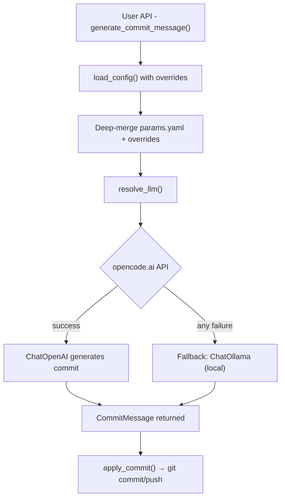

# LangChain AutoCommit v2

**LangChain AutoCommit** is an **agentic Git automation** library with automatic API fallback.  
It reads configuration from a bundled `params.yaml` file, uses the **opencode.ai API** as the primary LLM (serving models like DeepSeek, Qwen, Kimi), and falls back to a **local Ollama model** if the API is unavailable. It generates **conventional commit messages** based on the current Git diff.

New in v2: installable **Python library** with a clean programmatic API, deep-merge config overrides, and an optional CLI.

---

## Package Structure

| Path | Description |
|------|--------------|
| `autocommit/__init__.py` | Public API: `generate_commit_message`, `apply_commit`, `generate_and_commit`, `CommitMessage`, `load_config`, `deep_merge` |
| `autocommit/core.py` | Core library — commit message generation and application |
| `autocommit/config.py` | Config loader with deep-merge override support |
| `autocommit/cli.py` | Optional CLI entrypoint |
| `autocommit/chains/commit_chain.py` | LangChain pipeline using `PromptTemplate` + chat model |
| `autocommit/utils/git_utils.py` | Lightweight Git wrapper using subprocess |
| `autocommit/utils/llm_provider.py` | LLM provider resolution with automatic fallback |
| `autocommit/utils/keychain.py` | macOS Keychain wrapper; env var also supported |
| `autocommit/params.yaml` | Bundled default configuration |
| `pyproject.toml` | Package metadata and dependencies |
| `tests/` | pytest suite (54 tests) |

---

## Library Usage

### Install

```bash
pip install git+https://github.com/brandon-benge/langchain_autocommit.git
```

Or pin to a tag or branch:

```bash
pip install git+https://github.com/brandon-benge/langchain_autocommit.git@v2.0.0
pip install git+https://github.com/brandon-benge/langchain_autocommit.git@main
```

### Quick Start

```python
from autocommit import generate_commit_message, apply_commit

# Generate a commit message from staged changes
msg = generate_commit_message()
print(msg.subject)
print(msg.body)

# Apply it
apply_commit(msg)
```

### One-liner

```python
from autocommit import generate_and_commit

msg = generate_and_commit()
```

### With Overrides

All overrides are keyword arguments. The bundled `params.yaml` provides defaults for any value you don't supply.

```python
from autocommit import generate_and_commit

msg = generate_and_commit(
    type="feat",
    scope="api",
    ticket="PROJ-123",
    context="Added rate limiting middleware",
    committer="Jane Doe",
    config_overrides={"git": {"max_subject_length": 120}},
)
```

### Config Overrides

The bundled `autocommit/params.yaml` is the default baseline. You can override any part of it with a dict that gets deep-merged:

```python
from autocommit import load_config, generate_commit_message

cfg = load_config(overrides={
    "llm": {
        "primary": {"model": "deepseek-v4-pro"},
    },
    "git": {
        "autostage_all": False,
        "push_after_commit": False,
    },
})

msg = generate_commit_message(config=cfg)
```

Or pass `config_overrides` directly to the convenience functions:

```python
msg = generate_commit_message(
    config_overrides={"llm": {"primary": {"timeout": 120}}}
)
```

### Full `generate_commit_message()` Signature

```python
def generate_commit_message(
    *,
    config: dict | None = None,
    config_overrides: dict | None = None,
    type: str | None = None,
    scope: str | None = None,
    ticket: str | None = None,
    context: str = "",
    committer: str = "",
    max_subject_length: int | None = None,
    cwd: str | None = None,
    autostage: bool | None = None,
    conventional: bool | None = None,
    dry_run: bool = False,
) -> CommitMessage
```

- `CommitMessage` is a `NamedTuple` with `.subject` and `.body` fields.
- When `None`, each parameter falls back to the merged config (params.yaml + overrides).
- Returns an empty `CommitMessage` (both fields `""`) when there are no changes.

### Full `apply_commit()` Signature

```python
def apply_commit(
    message: CommitMessage,
    *,
    cwd: str | None = None,
    signoff: bool = False,
    amend: bool = False,
    push_after: bool = False,
) -> None
```

### Full `generate_and_commit()` Signature

```python
def generate_and_commit(
    *,
    config: dict | None = None,
    config_overrides: dict | None = None,
    type: str | None = None,
    scope: str | None = None,
    ticket: str | None = None,
    context: str = "",
    committer: str = "",
    max_subject_length: int | None = None,
    cwd: str | None = None,
    autostage: bool | None = None,
    conventional: bool | None = None,
    signoff: bool | None = None,
    amend: bool | None = None,
    push_after: bool | None = None,
) -> CommitMessage
```

---

## Configuration: `params.yaml`

Bundled with the package. All runtime defaults live here.

```yaml
project_name: "LangChain AutoCommit"
python_version: "3.10"
venv_dir: "../venv"

llm:
  primary:
    base_url: "https://opencode.ai/zen/go/v1"
    model: "deepseek-v4-flash"
    temperature: 0.2
    max_tokens: 512
    timeout: 60
    # keychain:
    #   service: "langchain_autocommit"
    #   key: "opencode_api_key"
    env_var: "OPENCODE_API_KEY"

  fallback:
    base_url: "http://localhost:11434"
    model: "qwen3:8b"
    temperature: 0.2
    max_tokens: 4096

git:
  autostage_all: true
  signoff: true
  push_after_commit: true
  allow_amend: false
  conventional: true
  default_type: "chore"
  scope_from_folder: true
  max_subject_length: 100
  ticket_regex: '[A-Z]{2,}-\d+'

paths:
  logs_dir: "logs"
  temp_dir: "tmp"
```

### Notable Fields

| Section | Key | Meaning |
|----------|-----|---------|
| **llm.primary** | `base_url` | API endpoint (e.g. `https://opencode.ai/zen/go/v1`) |
|  | `model` | Model name, e.g. `deepseek-v4-flash`, `deepseek-v4-pro` |
|  | `timeout` | Seconds before triggering fallback |
|  | `keychain.service` | macOS Keychain service name for API key lookup |
|  | `keychain.key` | macOS Keychain key name for API key lookup |
|  | `env_var` | Name of env var to read API key from (alternative to keychain; cannot use both) |
| **llm.fallback** | `base_url` | Ollama endpoint (default `http://localhost:11434`) |
|  | `model` | Model name, e.g. `qwen3:8b` |
|  | `temperature` | Sampling temperature (lower = more deterministic) |
| **git** | `autostage_all` | If true, automatically stages all changes |
|  | `conventional` | Enforces `<type>(<scope>): <subject>` style |
|  | `ticket_regex` | Extracts ticket ID from branch name |
|  | `max_subject_length` | Clamps subject length to a safe limit |

---

## How Type, Scope, and Ticket Are Resolved

You don't need to pass any overrides — these values are inferred automatically from your repository state:

| Value | Source | Default | Example |
|-------|--------|---------|---------|
| **type** | File path heuristics: `tests/` or `*_test.py` → `test`, `docs/` or `*.md` → `docs`, `scripts/` or `*.sh` → `chore`, everything else → `feat` | `git.default_type` (`"chore"`) | `feat`, `docs`, `test` |
| **scope** | Basename of the current working directory (the repo folder name) | `git.scope_from_folder: true` | `langchain_autocommit` |
| **ticket** | Regex match against the current git branch name | `git.ticket_regex` (`[A-Z]{2,}-\d+`) | `PROJ-123` from branch `feat/PROJ-123-add-auth` |

To customize any of these, pass overrides in your code or edit the `params.yaml` bundled with the package.

---

## How It Works



---

## API Key Setup

### Option A: Environment variable (recommended for cloud/CI)

```bash
export OPENCODE_API_KEY="your-api-key"
```

The bundled `params.yaml` uses `env_var: "OPENCODE_API_KEY"` by default — no changes needed.

### Option B: macOS Keychain (CLI only)

```bash
autocommit --setup-key
```

Then uncomment the `keychain` block in `params.yaml` and comment out `env_var`.

> **Important:** Only ONE method may be configured. Setting both `keychain` and `env_var` causes an error.

---

## CLI Usage (Optional)

The CLI is available as a secondary entry point:

```bash
pip install git+https://github.com/brandon-benge/langchain_autocommit.git
autocommit --autostage
```

### CLI Flags

| Flag | Description |
|------|-------------|
| `-c, --context TEXT` | Optional context describing what changed and why |
| `-n, --committer TEXT` | Committer name to include in commit body |
| `-t, --type TYPE` | Override commit type |
| `-s, --scope SCOPE` | Override commit scope |
| `--ticket TICKET` | Override ticket ID |
| `--max-subject-length N` | Override max subject length |
| `--autostage` / `--no-autostage` | Enable/disable auto-staging |
| `--amend` / `--no-amend` | Enable/disable amending |
| `--push` / `--no-push` | Enable/disable push after commit |
| `--signoff` / `--no-signoff` | Enable/disable Signed-off-by |
| `--conventional` / `--no-conventional` | Enable/disable conventional format |
| `--dry-run` | Show proposed commit without applying |
| `-y, --yes` | Skip confirmation prompt |
| `--show-config` | Print parsed config and exit |
| `--setup-key` | Store API key in macOS Keychain |

---

## Testing

```bash
python -m pytest
```

With coverage:

```bash
python -m pytest --cov-report=term-missing
```

---

## LangChain Design Pattern

The chain in `autocommit/chains/commit_chain.py` is provider-agnostic:

```python
chain = (
    RunnableMap({
        "type": lambda x: x.get("type"),
        "scope": lambda x: x.get("scope"),
        ...
    })
    | PromptTemplate.from_template(COMMIT_PROMPT)
    | llm  # Any LangChain chat model
)
```

This keeps the project fully **LangChain-native**, using `RunnableMap` for variable injection, `PromptTemplate` for input templating, and a configurable LLM resolved at runtime.

---

## Design Principles

| Principle | Implementation |
|------------|----------------|
| **YAML-Driven Config** | All parameters read from bundled `params.yaml` |
| **Deep-Merge Overrides** | Programmatic config overrides merge recursively |
| **Secure Key Storage** | API key from env var or macOS Keychain |
| **Automatic Fallback** | Primary API failure → local Ollama |
| **Provider Agnostic** | Chain accepts any LangChain chat model |
| **Library-First** | Clean Python API as the primary interface |

---

## License

- Project: **Apache-2.0**
- Dependencies:
  - **LangChain** – MIT
  - **keyring** – MIT
  - **Ollama** – Apache 2.0
  - **Python stdlib** – PSF License
